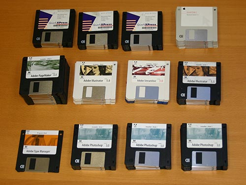

<!DOCTYPE html>
<html lang="en">
  <head>
    <meta charset="UTF-8" />
    <title>CatComputing.com</title>
    <link href="css/style.css" rel="stylesheet" />
  </head>

  <body>
    <!-- header begins -->
    <header id="top">
      <h1>CatComputing.com</h1>
      
<em>Grand Opening: Monday, October 8

      <nav>
        <ul>
          <li><a href="#hardware">Hardware</a></li>
          <li><a href="#software">Software</a></li>
        </ul>
      </nav>

    </header>
    <!-- header ends -->

    <!-- main begins -->
    <main>
      <section id="hardware">
        <h2>Hardware</h2>

        <article>
          
The hardware department of CatComputing.com is managed by Flynn's Retro Computers, a web shop dedicated to old-school minicomputers from the 1970s and 1980s. We've got the most complete <em>cat</em>alog anywhere on the Internet!

          <aside>
            
            
An array of our vintage computers. <em>(Photo by Stefano Paganini, CC BY-SA 2.0)</em>

          </aside>

        </article>
      </section>

      <section id="software">
        <h2>Software</h2>
        <article>
          
The software department of CatComputing.com is managed by Quorra's Software Shack. We can supply all your software needs, from programming languages and operating systems to applications and games.

          <aside>
            
            
Only the finest software! <em>(Photo by Greg Smith, CC BY-NC 2.0)</em>

          </aside>

        </article>
      </section>

    </main>
    <!-- main ends -->

    <!-- footer begins -->
    <footer>
      
Menu:

      <nav>
        <ul>
          <li><a href="top">Return to top</a></li>
          <li><a href="#hardware">Hardware</a></li>
          <li><a href="#software">Software</a></li>
        </ul>
      </nav>

      
<small>&copy; 2018. All Rights Reserved.</small>

    </footer>
  </body>
</html>
